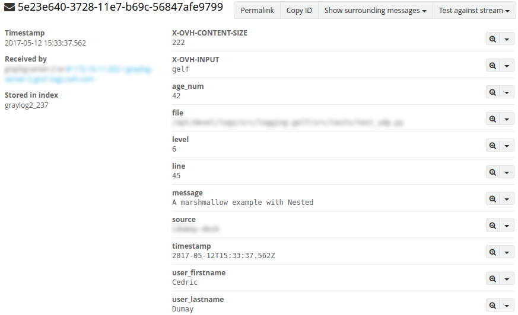

.. _logging-ldp:

Send logs to OVH LDP
====================

You can easly send logs to the `OVH Logs Data Platform service <https://logs.ovh.com>`_
using an implementation of this library: `logging-ldp <https://pypi.org/project/logging-ldp/>`_

Log entry in Graylog
--------------------

